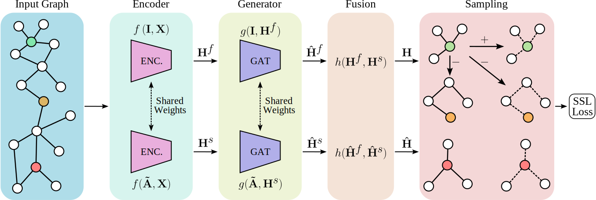

# A Fused Gromov-Wasserstein Approach to Subgraph Contrastive Learning




Self-supervised learning has emerged as a pivotal paradigm
for training deep learning models in scenarios where labeled data is scarce
or unavailable. While graph machine learning holds great promise across
various domains, the design of effective pretext tasks for self-supervised
graph representation learning remains challenging. Contrastive learn-
ing, a prominent approach in self-supervised learning on graphs, lever-
ages positive and negative pairs to compute a contrastive loss func-
tion. However, existing graph contrastive learning methods often strug-
gle to fully exploit structural patterns and node similarities. To overcome
these limitations, we introduce a novel approach termed Fused Gromov
Wasserstein Subgraph Contrastive Learning (FOSSIL). Our method in-
tegrates node-level and subgraph-level contrastive learning, seamlessly
combining a standard node-level contrastive loss with the Fused Gromov-
Wasserstein distance. This integration enables our method to capture
both node features and graph structure jointly. Notably, our approach is
capable of handling both homophilic and heterophilic graphs and dynam-
ically extracts view representations for positive and negative pairs gener-
ation. Extensive experimentation on benchmark graph datasets demon-
strates that FOSSIL outperforms or achieves competitive performance
compared to state-of-the-art methods. 

## Usage

### Training
Here is an example command to launch a training
```
python train.py --dataset cora --config configs/config.yaml 
```

### Hyperparameter tuning
Here is an example command to launch hyperparameter tuning
```
python hyperparam_tuning.py --dataset cora --config configs/config.yaml 
```

### Evaluation
Here is an example command to launch evaluation
```
python eval.py --dataset cora --config configs/config.yaml 
```
 
